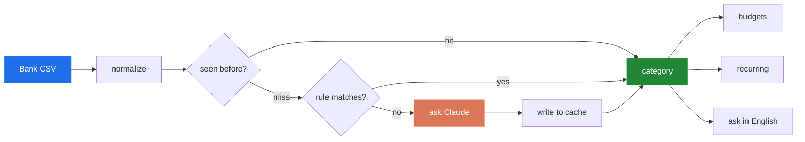
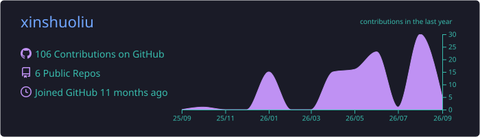
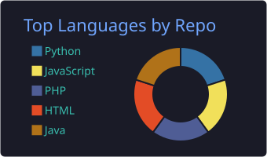
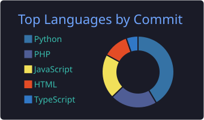
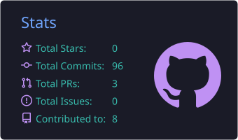
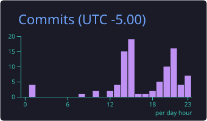
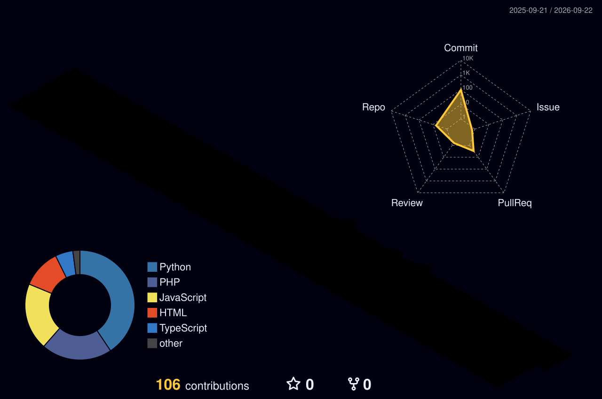

  

  
  

  
  
  

 

## 👋 whoami

|  |  |
|:--|:--|
| 🎓 | Software engineering student in Montréal, Québec |
| 🛠️ | I learn by building: finance tooling, aggregators, web apps |
| 🌱 | Going deeper on backend systems and data pipelines |
| 🧪 | Learning to *measure* LLM features instead of eyeballing them |
| 💬 | Français · English · 中文 |
| 🎯 | Open to internships and collaboration |

 

## 🧰 Toolbox

   
  

 

## 🚀 What I am building

<table>
<tr>
<td width="50%" valign="top">

### 💸 [Finance](https://github.com/xinshuoliu/Finance)

`Python` `Streamlit` `Anthropic API`

Personal finance dashboard. Drop in a bank CSV and every transaction gets categorized through a **cache → rules → LLM cascade**, so the cheap paths run first and the model only ever sees what the rules could not resolve. Budgets, recurring payment detection, plain English querying.

Ships with an eval harness, so accuracy is a number rather than a vibe.

**🔗 [urfinance.streamlit.app](https://urfinance.streamlit.app/)**

</td>
<td width="50%" valign="top">

### 🔍 [Job_Hunter](https://github.com/xinshuoliu/Job_Hunter)

`Java 21` `Maven` `SQLite` `Docker`

Multi source job aggregator. Polls Adzuna and Arbeitnow, filters by keyword, salary and location, deduplicates on normalized title plus company, then pushes matches to Discord, email or console.

New sources plug in behind a `JobProvider` interface. Rate limits persist across restarts, and nothing is marked delivered until every channel confirms.

</td>
</tr>
<tr>
<td width="50%" valign="top">

### 🎬 [Movie_App](https://github.com/xinshuoliu/Movie_App)

`React 19` `Vite` `React Router`

Movie browser on a public API. Search, client side routing, context driven state, and a services layer that keeps fetch logic out of the components.

</td>
<td width="50%" valign="top">

### 🎟️ [TCH056_Travail_de_session](https://github.com/xinshuoliu/TCH056_Travail_de_session)

`PHP` `MySQL` `Docker`

Full stack event site with a hand rolled router, account creation and sessions, and a real SQL schema with seed data. No framework, on purpose.

</td>
</tr>
</table>

<b>🧠 How the Finance categorizer actually decides (click to expand)</b>

 

Every transaction takes the cheapest path that can answer it. The cache catches repeats, hand written rules catch the obvious merchants, and only genuine unknowns cost an API call. Results are written back to the cache, so the expensive path keeps shrinking.

<b>📚 Coursework worth a look</b>

 

**[TP1_INF111](https://github.com/xinshuoliu/TP1_INF111)** · `Java`
 Client/server library management system, split into independent client and server modules.

 

## 📈 The numbers

These five cards are not hotlinked from somebody else's server. A GitHub Action
renders them nightly and commits the SVGs into this repo, so they cannot break when a
free hosting tier goes down.

  

  
  

  
  

  

 

## 🧊 A year of commits, in 3D

  

 

## 🐍 Watch a snake eat my contributions

  <picture>
    <source media="(prefers-color-scheme: dark)" srcset="https://raw.githubusercontent.com/xinshuoliu/xinshuoliu/output/github-snake-dark.svg" />
    <source media="(prefers-color-scheme: light)" srcset="https://raw.githubusercontent.com/xinshuoliu/xinshuoliu/output/github-snake.svg" />
    
  </picture>

 

